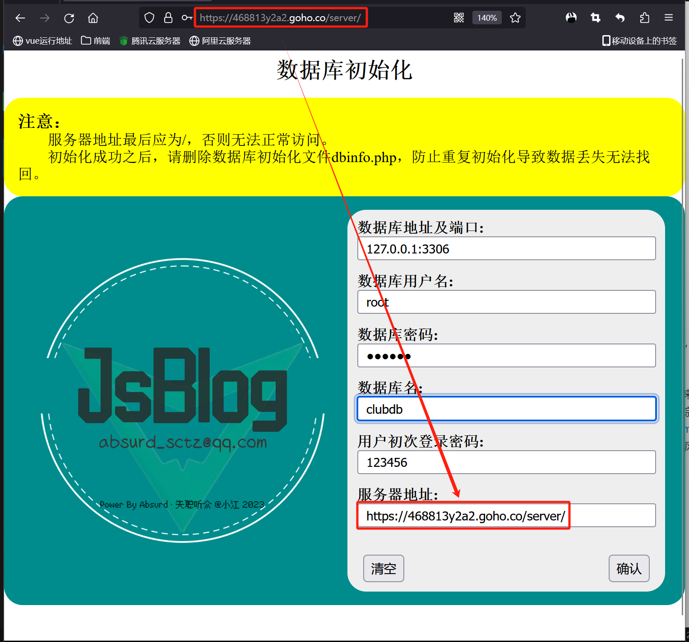
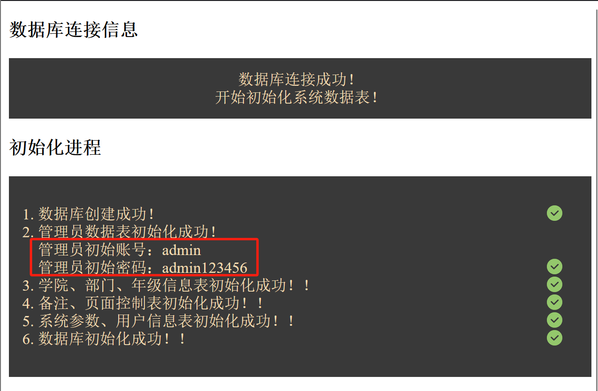

# InterviewManagementJxs

#### 介绍
基于Vue+PHP的社团面试信息管理系统 3.0

#### 软件架构
软件架构说明

clubWeb为前端文件，基于vue.js开发
server为后端文件，基于PHP开发

#### 安装教程

##### 后端环境
1.  将server文件夹放在服务器目录下
2.  数据库建议使用MySQL5.0以上的版本
3.  在浏览器打开服务器地址，按要求输入数据库信息后点击确认（注意：此处服务器地址最后必须是“/”结尾）

4.  点击确认后，数据库会自动进行初始化

5.  初始化成功后，可删除index.html文件文件防止恶意数据库初始化，然后即可进行前端环境搭建

##### 前端环境
1.  将clubWeb文件夹放在服务器目录下
2.  打开js/serverUrl.js文件，将文件里的地址改为服务器地址，即后端搭建时填写的地址，不需要后边的“/”
3.  在浏览器中输入前端地址即可使用

#### 使用说明

1.  本系统基于Vue+PHP开发，于2024年年初完成2.0到3.0版本升级，2.0版本基于PHP开发，在一定程度上有很大的缺陷。
2.  本系统部分开源，技术简单没得什么破解难度，没必要研究也没必要去研究，写出来主要是因为作者之前经历的一些事情，为了方便，也为了告别。也不要拿去商用噶，虽然没得商用价值，但还是要声明一下的。
3.  xxxx

#### 参与贡献

1.  Fork 本仓库
2.  新建 Feat_xxx 分支
3.  提交代码
4.  新建 Pull Request

#### 特技

1.  使用 Readme\_XXX.md 来支持不同的语言，例如 Readme\_en.md, Readme\_zh.md
2.  Gitee 官方博客 [blog.gitee.com](https://blog.gitee.com)
3.  你可以 [https://gitee.com/explore](https://gitee.com/explore) 这个地址来了解 Gitee 上的优秀开源项目
4.  [GVP](https://gitee.com/gvp) 全称是 Gitee 最有价值开源项目，是综合评定出的优秀开源项目
5.  Gitee 官方提供的使用手册 [https://gitee.com/help](https://gitee.com/help)
6.  Gitee 封面人物是一档用来展示 Gitee 会员风采的栏目 [https://gitee.com/gitee-stars/](https://gitee.com/gitee-stars/)
